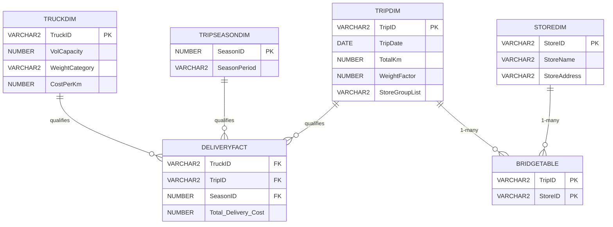

# [[Bridge Tables]]

**Context:** [[FIT3003_MOC]] · Chapter 5 · the *forced* family of [[Snowflake Schema|snowflaking]] — the SQL that builds one lives in [[Building Bridge Table Schemas]]
**Parent Framework:** [[Snowflake Schema]]

> [!abstract] Quick Revision
> - **🎯 Objective:** spot the **many-many in the operational E/R** that stops a dimension reaching the fact ➔ resolve it with a bridge table hanging off the dimension that *can* reach the fact.
> - **📦 Core Components:** **Bridge** ➔ key pair, 1-many then many-1 | **Weight factor** ➔ estimates one member's share of the measure | **List aggregate** ➔ the group spelled out in the parent dimension.
> - **⚡ Key Constraint:** the measure belongs to the **parent** entity, not the bridged one — a delivery cost is a property of the *trip*, so a per-store figure is always an **estimate**, never a stored fact.

## 📝 How It Works
### 1. What a bridge table is
- **Core Mechanism:** **Links two dimensions, only one of which touches the fact** ➔ the star becomes a [[Snowflake Schema|snowflake]]; the bridge is itself a snowflake table.
- **Rules That Always Hold:** **Cardinality reads 1-many then many-1** ➔ parent dimension $\rightarrow$ bridge $\rightarrow$ child dimension; the bridge's PK is the **composite of both dimension keys** ➔ [[Associative Entity]].
- **Where it comes from** ➔ the operational database's own associative table ($\text{STOCKSUPPLIER}$, $\text{DESTINATION}$) copied across almost verbatim.

### 2. When a dimension cannot reach the fact
- **Reason 1 — no direct relationship** ➔ the fact holds a measure and the dimension holds a key identity, but nothing in the source ties one to the other.
- **Reason 2 — many-many in the source** ➔ the two operational entities holding the dimension's key identity and the intended measure are m–m, so the pairing simply is not recorded.
- **Reason 3 — history to keep** ➔ the operational database maintains a temporal aspect ($\text{SupplyDate}$, $\text{QtySupplied}$); the bridge is where those temporal attributes can live without disturbing either dimension.

### 3. Product Sales — the many-many that breaks the fact
- **The question:** total sales $=$ $\text{quantity} \times \text{price}$ by product, customer suburb, time period **and supplier**.
- **The initial star:** $\text{ProductSalesFACT}(\underline{\text{TimeID}^{*}, \text{ProductNo}^{*}, \text{Suburb}^{*}}, \text{TotalSales})$ with $\text{TimeDIM}$, $\text{ProductDIM}$, $\text{CustLocDIM}$ — correct, and supplier-free.
- **The naive fix fails:** **adding $\text{SupplierID}$ to the fact** ➔ a sale record never says *which* supplier supplied the sold unit, so every $(\text{Time}, \text{Suburb}, \text{Product})$ row is repeated once per supplier of that product with no way to apportion the money.
- **The bridge:** $\text{ProductSupplierBRIDGE}(\underline{\text{ProductNo}^{*}, \text{SupplierID}^{*}}, \text{SupplyDate}, \text{Location}, \text{QtySupplied})$ hangs below $\text{ProductDIM}$, with $\text{SupplierDIM}$ below it.
- **Three shapes of the same idea** ➔ with a $\text{SupplierDIM}$ · **without** one ($\text{SupplierName}$ absorbed into the bridge) · **without history** (bridge shrinks to $\text{ProductNo}, \text{SupplierName}$).

### 4. Truck Delivery — the measure that belongs to another entity
- **The source:** $\text{Trip}(\underline{\text{TripID}}, \text{Date}, \text{TotalKm}, \text{TruckID}^{*})$, $\text{Truck}(\underline{\text{TruckID}}, \dots, \text{CostPerKm})$, $\text{Destination}(\underline{\text{TripID}^{*}, \text{StoreID}^{*}})$ — the m–m between trip and store.
- **The measure:** $\text{Total\_Delivery\_Cost} = \text{TotalKm} \times \text{CostPerKm}$.
- **Three points of view, one failure** ➔ per **truck** works ($\text{Truck1}$ runs $\text{Trip1} + \text{Trip4} = 820\text{ km}$ at $\$1.20/\text{km}$); per **date** works; per **store** does not, because a trip delivers to many stores and the cost is the trip's.
- **The correct schema:** $\text{DeliveryFACT}(\underline{\text{TruckID}^{*}, \text{TripID}^{*}, \text{SeasonID}^{*}}, \text{Total\_Delivery\_Cost})$ — the fact re-keys onto $\text{TripID}$, and $\text{StoreDIM}$ is reached through $\text{BridgeTable}(\underline{\text{TripID}^{*}, \text{StoreID}^{*}})$.

### 5. Two optional refinements
- **Weight factor** ➔ $w = 1 / (\text{stores on the trip})$, so a five-store trip gives each store $0.20$ of the cost; it **estimates** a member's contribution and is only added when that estimate is wanted.
- **Where the weight lives** ➔ in the **parent dimension** ($\text{TripDIM}$), not the bridge: every store of $\text{Trip1}$ carries the same $0.20$, so storing it per bridge row is redundant.
- **List aggregate** ➔ $\text{StoreGroupList} = \texttt{M1\_M2\_M3\_M4\_M8}$ concatenated into $\text{TripDIM}$; it shows the decision maker the *completeness* of the group and removes one join, at the cost of redundancy.

## 🗂️ Schema

*($\text{WeightFactor}$ appears in Solution Model 2, $\text{StoreGroupList}$ in Solution Model 3 — Model 1 has neither)*

## ⚖️ Core Decision Matrix
| Solution model | $\text{TripDIM}$ extra columns | Answers "cost per store?" | Join to reach a store | Cost |
| :--- | :--- | :--- | :--- | :--- |
| **1 — bridge only** | none | **no** — only "which stores did this trip serve" | $\text{fact} \rightarrow \text{TripDIM} \rightarrow \text{Bridge} \rightarrow \text{StoreDIM}$ | nothing extra |
| **2 — $+$ weight factor** | $\text{WeightFactor}$ | **estimated** — $\sum (\text{cost} \times w)$ | same three joins | the figure is an estimate, not a measured fact |
| **3 — $+$ list aggregate** | $\text{WeightFactor}, \text{StoreGroupList}$ | estimated, as Model 2 | $\text{TripDIM} \bowtie \text{StoreDIM}$ on a $\texttt{LIKE}$ against the list — **one join fewer** | redundant string; $\texttt{LISTAGG}$ is complex to build |

> [!NOTE] **When It Flips:** add the weight factor only when management actually wants a per-member share of the measure — without it the star is still correct, it simply cannot estimate delivery cost per store. Add the list aggregate only when the *visual completeness* of the group matters to the reader.

## 📊 Exam Execution Trace & Applied Exercises

### Manual Execution Trace — why $\text{SupplierID}$ cannot sit in the fact
| Step | Fact row $(\text{TimeID}, \text{Suburb}, \text{ProductNo})$ | $\text{SupplierID}$ added | $\text{TotalSales}$ | Verdict |
| :--- | :--- | :--- | :--- | :--- |
| 1 | $(201801, \text{Caulfield}, \text{A1})$ | $\text{S1}$ | ? | the sale never named a supplier |
| 2 | $(201801, \text{Caulfield}, \text{A1})$ | $\text{S2}$ | ? | same sale, second supplier of $\text{A1}$ |
| 3 | $(201801, \text{Caulfield}, \text{A1})$ | $\text{S3}$ | ? | one sale now spread over $n$ rows |
| 4 | $(201801, \text{Caulfield}, \text{B2})$ | $\text{S1}$ | ? | the explosion repeats per product |

**Final Extracted Output:** the measure cannot be divided among the suppliers, so every candidate value is wrong — $\text{Supplier}$–$\text{Product}$ being m–m is exactly the condition that forces a bridge instead of a fourth dimension key.

### Applied Exercise
**Problem:** management also wants the **date** each supply was delivered, alongside $\text{TimeID}$, in the same report.
$$
\begin{aligned}
\text{fact grain} &= (\text{TimeID}, \text{Suburb}, \text{ProductNo}) \\
\text{one } (\text{product}, \text{supplier}) \text{ pair} &\Rightarrow \text{many } \text{SupplyDate} \text{ values} \\
\text{adding } \text{SupplyDate} \text{ to the fact} &\Rightarrow \text{conflict with } \text{TimeID} \text{ and a second explosion}
\end{aligned}
$$
**Final Extracted Output:** $\text{SupplyDate}$ belongs in the **bridge**, where the supply history has its own grain and never collides with the sales time key.

## ⚠️ Common Mistakes
- 💡 **Adding the far dimension's key to the fact** ➔ the pairing is not recorded in the source, so the measure gets duplicated across every partner instead of divided.
- 💡 **Storing the weight factor in the bridge** ➔ correct arithmetic, redundant storage: all stores of one trip share the trip's weight, so it belongs in the parent dimension.
- 💡 **Reading a weighted per-store cost as a measured value** ➔ it is an apportioned estimate; the measured cost is the trip's.
- 💡 **Leaving the fact keyed on the bridged dimension** ➔ $\text{StoreID}$ in $\text{DeliveryFACT}$ is the incorrect truck-delivery star; the fact must key the entity that owns the measure ($\text{TripID}$).

## 🧠 Active Recall
> [!FAQ]- Given a case study, what is the exact test that tells you a bridge table is required rather than one more dimension?
> > [!SUCCESS]- Answer
> > - **Short answer:** trace the candidate dimension back to the entity that owns the measure — if the path crosses a **many-many**, you need a bridge.
> > - **Why:** **The source decides** ➔ a fact FK asserts that each fact row has exactly one member of that dimension; an m–m in the operational E/R says the opposite, so the assertion is unsatisfiable. **Symptom to quote** ➔ the fact row multiplies across partners with an undividable measure ($\text{Supplier}$–$\text{Product}$; $\text{Trip}$–$\text{Store}$). **Placement** ➔ hang the bridge off the dimension that *does* reach the fact, then the far dimension below it ➔ [[Building Bridge Table Schemas]].

> [!FAQ]- A bridge table breaks the "every dimension one hop from the fact" rule that [[Dimension Hierarchies]] defends. Why is that acceptable here and not there?
> > [!SUCCESS]- Answer
> > - **Short answer:** a hierarchy is a **choice** among schemas that all work; a bridge is the **only** schema that works.
> > - **Why:** **No alternative exists** ➔ flattening a hierarchy is always available (the combined dimension), whereas the m–m cannot be flattened into a fact FK without inventing data the source never recorded. **The rule is a default, not an axiom** ➔ "link every dimension directly to the fact **whenever possible**"; the bridge is precisely the case where it is not possible.
