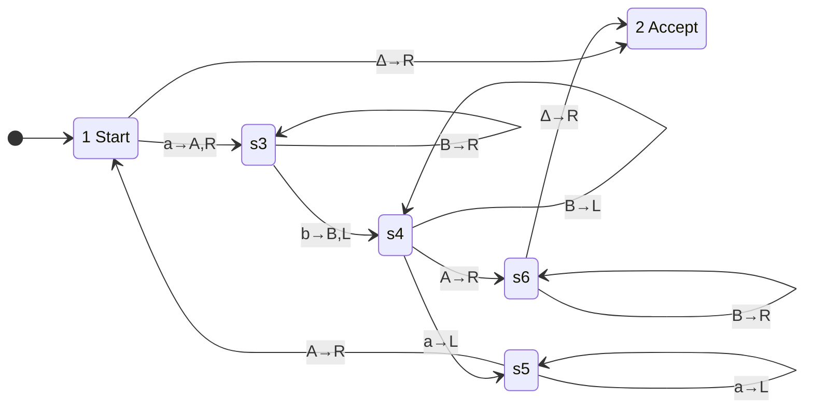

# [[Building Turing Machines]]

**Context:** [[FIT2014_MOC]] · the exam hand skill of [[Turing Machines]] — *"design a TM accepting $L$"* · the tape-level answer to the languages [[Proving a Language Non-Regular|the pumping lemmas]] ruled out
**Problem it solves:** turn a counting/matching language into a finite state diagram, using the **tape itself** as the counter.

> [!abstract] Quick Revision
> - **🎯 Trigger:** the language couples two or more unbounded counts ➔ **mark one symbol of each group per pass**, sweep back, repeat until one group runs out, then verify the others are exhausted too.
> - **⚠️ Key Constraint:** marking must be **reversible information, not destruction** — write a *distinct* symbol ($\texttt{A}$ for a consumed $\texttt{a}$, $\texttt{B}$ for a consumed $\texttt{b}$, $\texttt{\#}$ for a pass boundary) so the sweep-left phase can still tell "already matched" from "not yet reached".

## 📐 The marking recipe
1. **Handle $\varepsilon$ first** ➔ if the very first cell is $\Delta$, the input is empty; accept or reject immediately from State $1$.
2. **Mark one symbol** from the leftmost group and move right.
3. **Sweep right** over already-marked symbols and unprocessed ones until the *next* group's first unmarked symbol appears; mark it.
4. **Sweep left** back to the boundary marker, land on the first unmarked symbol of group 1, and **loop**.
5. **Detect exhaustion** ➔ when group 1 has no unmarked symbol left, leave the loop and **verify the tail**: sweep right over the remaining marks and require $\Delta$. Anything else ⟹ crash ⟹ reject.

- **⚡ Why this works and a PDA's stack wouldn't for $\ge 3$ groups** ➔ the head can revisit *any* cell, so the marks act as an arbitrary number of independent counters. This is exactly the capability $\mathtt{a}^n\mathtt{b}^n\mathtt{a}^n$ needed and could not get from a stack.

## 🔧 Worked machine 1 — $\{\mathtt{a}^n\mathtt{b}^n : n\ge 0\}$

> [!NOTE]- Lecture pseudocode
> ```text
> If the current letter is blank, then Accept string.
> Loop {
>     If current letter is a then change a to A & move right.
>     Move right over every a and B.
>     If current letter is b then change b to B & move left.
>     Move left over every B.
>     If current letter is A then move right & exit the loop.
>     If current letter is a then move left over every a.
>     If current letter is A then move right.
> }
> Move right over every B.
> If current letter is blank, then Accept string.
> ```



| State | Job |
| :--- | :--- |
| **1** | on the leftmost unmarked $\texttt{a}$ — mark it $\texttt{A}$, or accept on $\Delta$ |
| **3** | sweep right over $\texttt{a}$s and $\texttt{B}$s to the first unmarked $\texttt{b}$; mark it $\texttt{B}$ and turn left |
| **4** | sweep left over $\texttt{B}$s; an $\texttt{a}$ means more to match ($\to 5$), an $\texttt{A}$ means the $\texttt{a}$s are exhausted ($\to 6$) |
| **5** | sweep left over $\texttt{a}$s to the marked block, then step right into State $1$ |
| **6** | verification tail — sweep right over $\texttt{B}$s; only $\Delta$ accepts |

### Manual Execution Trace — $w=\mathtt{aabb}$
| Step | State | Pos | Tape | Read | Write | Move | Next |
| :--- | :--- | :--- | :--- | :--- | :--- | :--- | :--- |
| 0 | 1 | 0 | `aabb` | $\texttt{a}$ | $\texttt{A}$ | $R$ | 3 |
| 1 | 3 | 1 | `Aabb` | $\texttt{a}$ | $\texttt{a}$ | $R$ | 3 |
| 2 | 3 | 2 | `Aabb` | $\texttt{b}$ | $\texttt{B}$ | $L$ | 4 |
| 3 | 4 | 1 | `AaBb` | $\texttt{a}$ | $\texttt{a}$ | $L$ | 5 |
| 4 | 5 | 0 | `AaBb` | $\texttt{A}$ | $\texttt{A}$ | $R$ | 1 |
| 5 | 1 | 1 | `AaBb` | $\texttt{a}$ | $\texttt{A}$ | $R$ | 3 |
| 6 | 3 | 2 | `AABb` | $\texttt{B}$ | $\texttt{B}$ | $R$ | 3 |
| 7 | 3 | 3 | `AABb` | $\texttt{b}$ | $\texttt{B}$ | $L$ | 4 |
| 8 | 4 | 2 | `AABB` | $\texttt{B}$ | $\texttt{B}$ | $L$ | 4 |
| 9 | 4 | 1 | `AABB` | $\texttt{A}$ | $\texttt{A}$ | $R$ | 6 |
| 10 | 6 | 2 | `AABB` | $\texttt{B}$ | $\texttt{B}$ | $R$ | 6 |
| 11 | 6 | 3 | `AABB` | $\texttt{B}$ | $\texttt{B}$ | $R$ | 6 |
| 12 | 6 | 4 | `AABB` | $\Delta$ | $\Delta$ | $R$ | **2 — Accept** |

- **Failure check $\mathtt{aab}$** ➔ after both $\texttt{a}$s are marked the machine sits in State $3$ reading $\Delta$; State $3$ has **no $\Delta$ rule** ⟹ crash ⟹ reject.
- **Failure check $\mathtt{abb}$** ➔ State $6$ reaches the surplus unmarked $\texttt{b}$; State $6$ has **no $\texttt{b}$ rule** ⟹ crash ⟹ reject.

## 🔧 Worked machine 2 — $\{\mathtt{a}^n\mathtt{b}^n\mathtt{a}^n : n\ge 0\}$
Not context-free (see [[Proving a Language Non-Context-Free]]) — yet a TM handles it, because a **third** counter costs nothing on a tape.

> [!NOTE]- Lecture pseudocode
> ```text
> Loop {
>     If current letter is blank, then Accept string.
>     If current letter is a, then change a to A & move right.
>     Move right over a* b b*.
>     If current letter is a, then move left.
>     If current letter is b, then change b to a & move right.
>     Move right over every a.
>     If current letter is blank, then delete aa on the left.
>     Move left over every a and b.
>     If current letter is A, then move right.
> }
> ```

**Strategy** ➔ per pass, consume **one $\texttt{a}$ from the front** (mark it $\texttt{\#}$), **one $\texttt{b}$ from the middle** (rewrite it as $\texttt{a}$ so it joins the right block), then **delete two $\texttt{a}$s from the right end** — one for the rewritten $\texttt{b}$ and one for the trailing block. Every group shrinks in lockstep; the input is in $L$ iff they empty together.

| From | To | Read | Write | Move | Purpose |
| :--- | :--- | :--- | :--- | :--- | :--- |
| 1 | 3 | $\texttt{a}$ | $\texttt{\#}$ | $R$ | mark the front $\texttt{a}$ as the pass boundary |
| 3 | 3 | $\texttt{a}$ | $\texttt{a}$ | $R$ | sweep right over remaining front $\texttt{a}$s |
| 3 | 4 | $\texttt{b}$ | $\texttt{b}$ | $R$ | enter the $\texttt{b}$ block |
| 4 | 4 | $\texttt{b}$ | $\texttt{b}$ | $R$ | sweep right over the $\texttt{b}$s |
| 4 | 5 | $\texttt{a}$ | $\texttt{a}$ | $L$ | hit the rear block — step back onto the **last** $\texttt{b}$ |
| 5 | 6 | $\texttt{b}$ | $\texttt{a}$ | $R$ | rewrite that $\texttt{b}$ as an $\texttt{a}$ |
| 6 | 6 | $\texttt{a}$ | $\texttt{a}$ | $R$ | run to the right end |
| 6 | 7 | $\Delta$ | $\Delta$ | $L$ | found the end — turn around |
| 7 | 8 | $\texttt{a}$ | $\Delta$ | $L$ | delete the last $\texttt{a}$ |
| 8 | 9 | $\texttt{a}$ | $\Delta$ | $L$ | delete the second-last $\texttt{a}$ |
| 9 | 9 | $\texttt{a}$ | $\texttt{a}$ | $L$ | sweep left home |
| 9 | 9 | $\texttt{b}$ | $\texttt{b}$ | $L$ | sweep left home |
| 9 | 1 | $\texttt{\#}$ | $\texttt{\#}$ | $R$ | back at the boundary — next pass |
| 1 | 2 | $\Delta$ | $\Delta$ | $R$ | nothing left ⟹ **Accept** |

*(Lecture 18 draws this same machine with $\texttt{A}$ where Lecture 19's table writes $\texttt{\#}$ — same machine, and $\texttt{\#}$ is the symbol assumed by the tape alphabet $\{\texttt{a},\texttt{b},\texttt{\#}\}$ in [[Encoding Turing Machines (Code Words)]].)*

### Manual Execution Trace — $w=\mathtt{aba}$
| Step | State | Pos | Tape before | Read | Write | Move | Next |
| :--- | :--- | :--- | :--- | :--- | :--- | :--- | :--- |
| 0 | 1 | 0 | `aba` | $\texttt{a}$ | $\texttt{\#}$ | $R$ | 3 |
| 1 | 3 | 1 | `#ba` | $\texttt{b}$ | $\texttt{b}$ | $R$ | 4 |
| 2 | 4 | 2 | `#ba` | $\texttt{a}$ | $\texttt{a}$ | $L$ | 5 |
| 3 | 5 | 1 | `#ba` | $\texttt{b}$ | $\texttt{a}$ | $R$ | 6 |
| 4 | 6 | 2 | `#aa` | $\texttt{a}$ | $\texttt{a}$ | $R$ | 6 |
| 5 | 6 | 3 | `#aa` | $\Delta$ | $\Delta$ | $L$ | 7 |
| 6 | 7 | 2 | `#aa` | $\texttt{a}$ | $\Delta$ | $L$ | 8 |
| 7 | 8 | 1 | `#a` | $\texttt{a}$ | $\Delta$ | $L$ | 9 |
| 8 | 9 | 0 | `#` | $\texttt{\#}$ | $\texttt{\#}$ | $R$ | 1 |
| 9 | 1 | 1 | `#` | $\Delta$ | $\Delta$ | $R$ | **2 — Accept** |

## ✍️ Practice
> [!QUESTION]- Practice 1: convert the FA over $\{\texttt{a},\texttt{b}\}$ accepting strings ending in $\texttt{b}$ (states $q_0$ start, $q_1$ final; $q_0\xrightarrow{\texttt{b}}q_1$, $q_1\xrightarrow{\texttt{b}}q_1$, $q_1\xrightarrow{\texttt{a}}q_0$, $q_0\xrightarrow{\texttt{a}}q_0$) into a Turing machine, and say why the result is a decider.
> > [!SUCCESS]- Reference solution
> > Relabel $q_0\mapsto 1$, $q_1\mapsto 3$; rewrite every edge label $x$ as $x\to R$; drop $q_1$'s double circle and add $3\xrightarrow{\Delta\to R}2$:
> > ```mermaid
> > stateDiagram-v2
> >     direction LR
> >     [*] --> s1
> >     s1: 1 Start
> >     s2: 2 Accept
> >     s1 --> s1: a→R
> >     s1 --> s3: b→R
> >     s3 --> s3: b→R
> >     s3 --> s1: a→R
> >     s3 --> s2: ∆→R
> > ```
> > - **Key move:** every transition moves **right** and never writes, so after $|w|+1$ steps the head is past the input and the machine has halted ⟹ $\text{Loop}(T)=\emptyset$ ⟹ decider. State $1$ deliberately has **no** $\Delta$ rule, so strings ending in $\texttt{a}$ (and $\varepsilon$) crash ⟹ reject.

> [!QUESTION]- Practice 2: design a TM accepting $\{\mathtt{a}^n\mathtt{b}^n\mathtt{c}^n : n\ge 0\}$ over tape alphabet $\{\texttt{a},\texttt{b},\texttt{c},\texttt{A},\texttt{B},\texttt{C},\Delta\}$. Give the pseudocode, not the full diagram.
> > [!SUCCESS]- Reference solution
> > ```text
> > If the current letter is blank, then Accept string.
> > Loop {
> >     If current letter is a then change a to A & move right.
> >     Move right over every a and B.
> >     If current letter is b then change b to B & move right.
> >     Move right over every b and C.
> >     If current letter is c then change c to C & move left.
> >     Move left over every b, B, a and C, back to the last A.
> >     Move right.
> >     If current letter is B then exit the loop.
> > }
> > Move right over every B and C.
> > If current letter is blank, then Accept string.
> > ```
> > - **Key move:** the $\mathtt{a}^n\mathtt{b}^n$ machine **generalises by adding one marker alphabet per group** — the loop body gains one "sweep right, mark one" stage, the verification tail gains one symbol to sweep over. No new idea is needed, which is precisely why the language hierarchy stops mattering above the TM.

## ⚠️ Common Mistakes
- 💡 **Don't erase what you consume** ➔ overwrite $\texttt{a}\to\texttt{A}$ rather than $\texttt{a}\to\Delta$ inside the matching loop; blanking a cell mid-tape destroys the left/right sweep landmarks. *(Machine 2 only deletes at the **right end**, where nothing lies beyond.)*
- 💡 **Verify the tail, don't just exit the loop** ➔ leaving the loop means "group 1 exhausted"; you still must sweep right and require $\Delta$, or $\mathtt{ab}^3$ slips through.
- 💡 **Handle $\varepsilon$ explicitly** ➔ $n=0$ is in both languages here; if State $1$ has no $\Delta\to R$ edge to State $2$ the empty string crashes and you lose the base case.
- 💡 **Every state needs every rule you rely on** ➔ omitted (state, symbol) pairs are rejections **by design** in these machines; state which omissions are intentional, or a marker reads them as gaps.

## 🧠 Active Recall
> [!FAQ]- $\mathtt{a}^n\mathtt{b}^n\mathtt{a}^n$ is not context-free, so no PDA accepts it — what does the TM have that closes the gap?
> > [!SUCCESS]- Answer
> > - **Short answer:** **random access to its own memory.** A PDA can only see the top of its stack and must destroy it to look deeper; a TM's head can return to any cell, so marks left in three different regions of the tape act as three independent counters.
> > - **Why:** **Coupled counts $=$ marks, not pushes** ➔ the CFL pumping lemma failed on three groups because $uvxyz$ offers only **two** pumping sites. The machine-side mirror of that is: one stack $\Rightarrow$ one count kept in step. Machine 2 keeps three in step by shrinking each group by one per pass, a schedule that needs no memory beyond the tape marks themselves.
