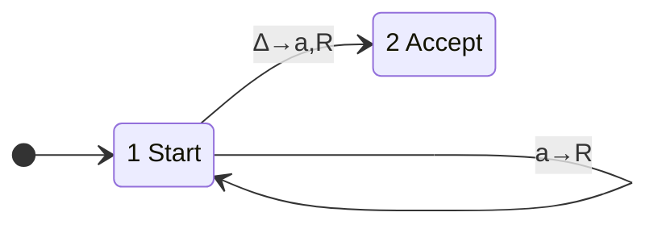
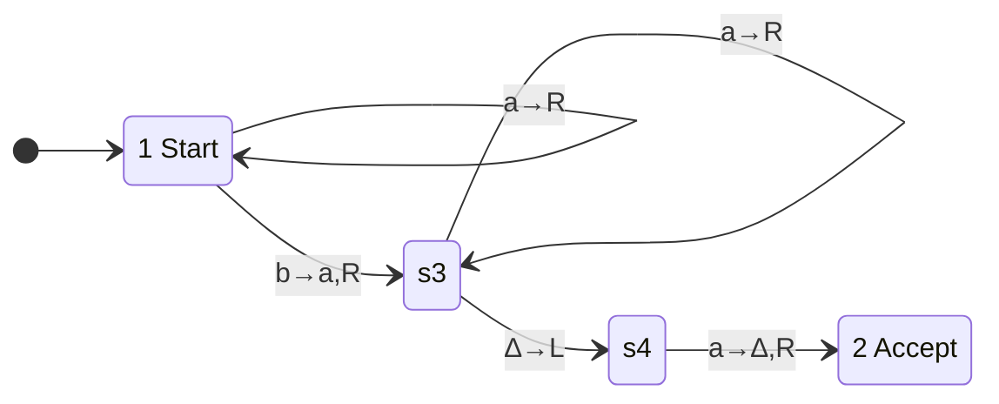
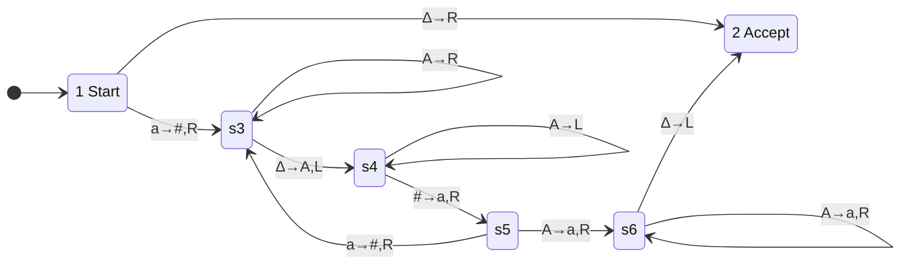

# [[Computable Functions and the Church-Turing Thesis]]

**Context:** [[FIT2014_MOC]] · upgrades [[Turing Machines]] from *acceptors* to *function computers* · the bridge from "machine" to "algorithm" that licenses every later undecidability argument

> [!abstract] Quick Revision
> - **🎯 Objective:** define $f$ **by** a TM — domain $=\text{Accept}(M)$, value $=$ the tape contents when $M$ halts ➔ $f$ is **computable** iff some TM computes it.
> - **📦 Core Components:** encoding scheme ➔ objects as strings | unary code ➔ $n\mapsto \texttt{a}^n$, tuples $\texttt{b}$-separated | Church–Turing thesis ➔ algorithm $\Rightarrow$ TM.
> - **⚡ Key Constraint:** the Church–Turing thesis is **not a theorem** — it equates an *informal* notion (algorithm) with a *formal* one (TM), so it can only be evidenced, never proved.

## 📝 How It Works

### 1. The function computed by a TM
For a Turing machine $M$:
- **Domain** ➔ $\text{Accept}(M)$ — inputs on which $M$ halts in the Accept state. Inputs in $\text{Reject}(M)$ or $\text{Loop}(M)$ have **no** value, so the function is in general **partial**.
- **Value** ➔ $x\mapsto$ the string left on the tape after $M$ halts, **excluding the trailing blanks**.
- **Computable function** ➔ $f:\Sigma^*\to\Sigma^*$ is *computable* if it is the function computed by **some** Turing machine.
- **Objects other than strings** ➔ to speak of computability for numbers, sequences, arrays, graphs you must **fix an encoding** of those objects as strings; $f$ is computable iff the induced string-to-string function is. The encoding is part of the claim, not an afterthought.

### 2. Encoding objects as strings
| Object | Scheme | Example |
| :--- | :--- | :--- |
| Character | **ASCII** over $\{\texttt{a},\texttt{b}\}$, fixed 6 letters | $\texttt{5}\mapsto\texttt{bbabab}$ |
| Integer | **binary** over $\{\texttt{a},\texttt{b}\}$ ($\texttt{a}=0$, $\texttt{b}=1$) | $6\mapsto\texttt{bba}$ |
| Integer | **unary** | $n\mapsto \texttt{a}^n$, so $0\mapsto\varepsilon$, $3\mapsto\texttt{aaa}$ |
| Tuple of $\mathbb{N}$ | unary parts, **separated by $\texttt{b}$** | $(1,0,2,3)\mapsto\texttt{abbaabaaa}$ |

- **Why unary for hand-built machines** ➔ "add one" becomes "write one more $\texttt{a}$", so arithmetic reduces to marking and sweeping instead of carry propagation.
- **Negative integers** ➔ adopt some convention letting one letter stand for the minus sign; the lecture leaves the choice open.

### 3. Three arithmetic machines (unary code)
**Successor** $f(n)=n+1$ ➔ run right to the blank, write an $\texttt{a}$.

**Addition** $f(n,m)=n+m$ on input $\texttt{a}^n\texttt{b}\,\texttt{a}^m$ ➔ turn the **separator** into an $\texttt{a}$ (joining the two blocks), then delete **one** $\texttt{a}$ from the right end to cancel it.

- **Trace $(1,1)=\texttt{aba}$** ➔ $\texttt{aba}\xrightarrow{\;\texttt{b}\to\texttt{a}\;}\texttt{aaa}\xrightarrow{\;\text{delete last}\;}\texttt{aa}=2$. ✓ And $(1,0)=\texttt{ab}\mapsto\texttt{aa}\mapsto\texttt{a}=1$. ✓

**Double** $f(n)=2n$ ➔ per pass, mark one $\texttt{a}$ as $\texttt{\#}$, append an $\texttt{A}$ at the right end, restore the $\texttt{\#}$; when the $\texttt{a}$s run out, rewrite every $\texttt{A}$ as an $\texttt{a}$.

- **Trace $n=2$** ➔ $\texttt{aa}\to\texttt{aaA}\to\texttt{aaAA}\to\texttt{aaaa}$; each original $\texttt{a}$ is **kept** and contributes **one** appended $\texttt{A}$, giving $n+n$. ✓
- **⚡ Contrast with acceptors** ➔ these machines still halt in State $2$, but what matters is now the **tape residue**, not the fact of acceptance. Same formalism, different reading.

### 4. Robustness — variations that change nothing
- **Direction** ➔ allowing "stay still" alongside $L/R$.
- **Tapes** ➔ two-way infinite; multiple tapes; separate input/output/work tapes; tapes of 2 or more dimensions.
- **Result** ➔ **the same class of computable functions** in every case. Together with the equivalences to NTMs, $k$TMs, 2PDAs and queue automata in [[Turing Machines]], the class refuses to grow.

### 5. Other routes to computability, and the thesis
| Approach | Originator | Year |
| :--- | :--- | :--- |
| Recursive function theory | Kurt Gödel | 1931 |
| Lambda calculus | Alonzo Church | 1936 |
| Turing machines | Alan Turing | 1936–37 |

> [!IMPORTANT] **Church–Turing Thesis.** Any function which can be defined by an **algorithm** can be computed by a **Turing machine**.

- **Not a theorem** ➔ "algorithm" is an informal, pre-mathematical notion, so there is nothing to prove *against*. It is **widely accepted**, not derived.
- **Evidence 1 — convergence** ➔ independently invented approaches (recursive functions, $\lambda$-calculus, TMs) all define the **same** class of functions.
- **Evidence 2 — long practice** ➔ decades of experience that algorithms can be implemented as programs, and therefore on Turing machines.
- **Evidence 3 — no counterexample** ➔ no algorithm has ever been exhibited that seems unimplementable on a TM.
- **Why it matters downstream** ➔ it lets a proof say *"there is no algorithm for $P$"* having only shown *"there is no TM for $P$"* — the licence for every undecidability result.

## ⚠️ Common Mistakes
- 💡 **The thesis is not provable** ➔ calling it "Church's theorem", or claiming it was proved by the equivalence of the three models, loses the mark. Convergence is **evidence**, not proof.
- 💡 **Computability is relative to an encoding** ➔ a function on graphs or sequences has no computability status until you fix how those objects become strings; say so explicitly in an exam answer.
- 💡 **Trailing blanks are not output** ➔ the value is the tape content **with the trailing blanks stripped**; forgetting this makes $f(n)$ look ill-defined.
- 💡 **The domain is $\text{Accept}(M)$, not $\Sigma^*$** ➔ a TM computing $f$ may loop or crash on other inputs; computable functions are **partial** unless the machine is a decider.
- 💡 **$0\mapsto\varepsilon$ in unary** ➔ the code for zero is the *empty string*, which is why the tuple separator $\texttt{b}$ is mandatory: $\texttt{abb aa}$ and $\texttt{ab baa}$ differ only by where the separators fall.

## 🧠 Active Recall
> [!FAQ]- Why is the Church–Turing thesis a *thesis* and not a theorem, and what would count as refuting it?
> > [!SUCCESS]- Answer
> > - **Short answer:** it identifies the **informal** notion "computable by an algorithm" with the **formal** notion "computed by a Turing machine". Only formal statements can be proved, and one side of this equation is not formal. It would be refuted by exhibiting a concrete procedure everyone accepts as an algorithm that provably **no** TM can carry out.
> > - **Why:** **Convergence is evidence, not derivation** ➔ Gödel's recursive functions, Church's $\lambda$-calculus and Turing machines were built from unrelated intuitions yet define the **same** function class; that, plus decades of implementation experience and zero counterexamples, is why it is universally assumed.

> [!FAQ]- A TM accepts a language; a TM computes a function. What exactly changes in the definition, and what stays fixed?
> > [!SUCCESS]- Answer
> > - **Short answer:** **nothing about the machine changes** — same states, same tape, same transitions, same halting-in-State-2 condition. What changes is what you *read off*: an acceptor reports only *whether* it reached State $2$; a function-computer additionally reads the **surviving tape content** (trailing blanks stripped) as the output.
> > - **Why:** **Domain $=\text{Accept}(M)$** ➔ the accepted language becomes the function's domain, so inputs in $\text{Reject}(M)$ or $\text{Loop}(M)$ simply have no image. This is why computable functions are **partial** in general and total exactly when the machine is a **decider**.

> [!FAQ]- Why does adding tapes, dimensions or nondeterminism never enlarge the class of computable functions?
> > [!SUCCESS]- Answer
> > - **Short answer:** every such machine can be **simulated** by a one-tape deterministic TM, because the extra structure can itself be **encoded onto one tape** (interleave $k$ tracks, serialise a 2-D grid, enumerate nondeterministic branches) — so any function computed by the richer machine is computed by a plain TM too.
> > - **Why:** **Robustness is the thesis's main evidence** ➔ each new "more powerful" model collapsing back to the same class is exactly the convergence that makes it plausible that the class captures *algorithm* itself, not merely one formalism's reach. The cost of simulation is **time**, never expressive power — see the slowdown bound in [[Universal Turing Machine]].
