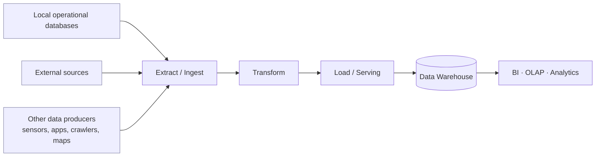

# [[Data Engineering]]

**Context:** [[FIT3003_MOC]] · the discipline that *builds the data* consumed by [[Data Science]] · its flagship deliverable is a [[Data Warehouse]]

> [!abstract] Quick Revision
> - **🎯 Objective:** treat data itself as the engineered product ➔ a repeatable pipeline replaces one-off ad-hoc cleaning.
> - **⚡ Key Constraint:** justifying the framework — marks come from arguing *repeatability, specialisation, quality assurance*, not from listing tools.

## 📝 Core
- **Product = data** ➔ DE designs and builds **data**; raw data already exists but **is not ready** — DE turns raw data into analysis-ready data.
- **Consumers** ➔ data scientists, data miners, data analysts, ML specialists; uses span modelling, prediction, trends, clustering, dashboards, descriptive/prescriptive and causal analysis.
- **Raw-data producers** ➔ transactions & databases · public/third-party datasets · sensor & measurement devices · applications, apps, crawlers · maps — arriving unstructured, structured, semi-structured, csv, specialised or multimedia.
- **Modularisation is the rationale** ➔ borrowed from software development (project → program → function hierarchy, `printf()` as a black box): **specialisation · quality assurance · abstraction**. Separate the pipeline into distinct processes (cleaning, warehousing, dashboarding) so no one rebuilds the whole chain.
- **Effort share** ➔ "Data Engineering = 80%" of the job; a genuinely small one-off project can skip the warehouse, but the framework is still what makes the work repeatable.

## 🧱 Software Engineering vs Data Engineering
*(the lecture asks the same 7 questions of both disciplines)*

| Question | Software Engineering | Data Engineering |
| :--- | :--- | :--- |
| What is the product? | software | **data** |
| What is it for? | end-user function | data analysis (models, trends, dashboards) |
| Who uses it? | end users | data scientists / analysts / ML specialists |
| Tools | IDEs, languages, frameworks | DBMS platforms (cloud/non-cloud), analytics tools |
| Methodology | SDLC processes | DE **architecture** + DE **components** |
| Raw materials | requirements, libraries | **raw data** (not yet ready) |
| Requirements | functional + non-functional | business goals, source systems, **data governance** |

## 🔀 Architecture and Dataflow
*(three source models, one identical three-phase spine)*

- **Model 1 — local databases** ➔ sources are the organisation's own operational systems behind the firewall.
- **Model 2 — external sources** ➔ sources sit outside the organisation (third-party feeds, partner extracts).
- **Model 3 — other data producers** ➔ non-database producers (sensors, applications, crawlers, maps).
- **Phase boundary** ➔ Extract/Ingest and Transform are the DE workload; Load/Serving is where the warehouse becomes queryable, and the [[Star Schema]] chosen at Load time fixes what questions can be asked later.

## 🧩 Components, Tools and Methodologies
- **Component 1 — Databases** ➔ [[Relational Model|relational]] tables + [[Data Integrity|data integrity]] · transaction management (unlike file systems) · [[ACID Properties|ACID]].
- **Component 2 — Data Warehouse** ➔ also relational technology, but adds **precomputed values** and an explicit **granularity** decision, and **must be pre-designed** ➔ [[Data Warehouse]].
- **Tool families** ➔ database & data-warehousing technologies; big-data tools; system tools (sensors, cloud); programming tools; visualisation tools.
- **Methodologies (the theoretical spine of the unit)** ➔ ETL · data-warehouse modelling · data analytics · storage and optimisation.

## 🧾 Requirements Checklist
- **Business & functional** ➔ stakeholder goals elicited at *company, team and business-user* levels; use cases naming the specific reports, metrics and analytical queries the system must support.
- **Data & infrastructure** ➔ source systems (CRM, transactional DBs, external files) · ETL/ELT pipelines · **data modelling** (star vs snowflake) · storage platform sized to data volume.
- **Governance & security** ➔ data-quality standards applied *before* load · access control restricting users to role-relevant data ➔ [[Data Management and Data Governance]].

## ⚠️ Common Mistakes
- 💡 **"Just clean it in a notebook"** ➔ fine once; fails the moment data arrives periodically, with new defects, from new sources, rebuilt by new people — the hospital case (5 hospitals, 2 years of csv extracts) is the lecture's exhibit for this.
- 💡 **Naming tools instead of the framework** ➔ the exam answer is *specialisation / QA / abstraction*, with tools as illustration only.

## 🧠 Active Recall
> [!FAQ]- The dashboard was built successfully once from the csv extracts. Why does the lecture still call the approach wrong?
> > [!SUCCESS]- Answer
> > - **Short answer:** it optimised a **one-off**, but the scenario is inherently **recurring**.
> > - **Why:** **Repeatability failure** ➔ new extracts arrive periodically, carry *different* defects, and reflect changed metrics/requirements; each cycle re-runs explore → clean → build, often by different people, so **quality assurance is unenforceable** and no work is reusable. **Modularisation fix** ➔ split the flow into separately owned, specialised, abstracted processes — which is exactly what a [[Data Warehouse]] framework imposes.

> [!FAQ]- The project is small. Is data warehousing then pointless?
> > [!SUCCESS]- Answer
> > - **Short answer:** no — you *can* do everything yourself, but you lose the framework.
> > - **Why:** **Framework value survives scale** ➔ the lecture concedes a small project needs no warehouse, yet keeps warehousing "very important" because it supplies the structure (separation of cleaning, storage, serving) that makes the result auditable and extensible.
