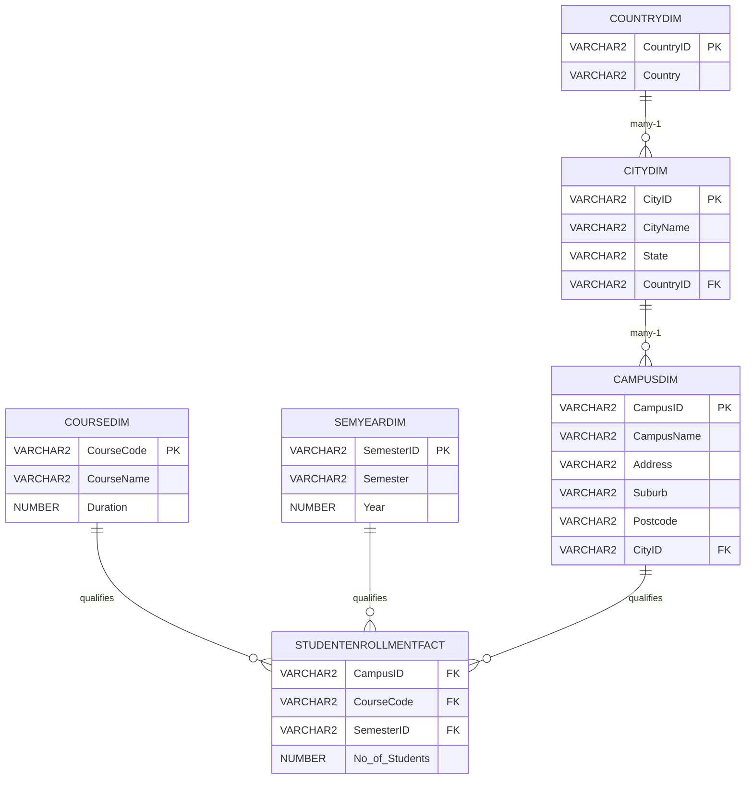

# [[Dimension Hierarchies]]

**Context:** [[FIT3003_MOC]] · Chapter 4 · the *optional* family of [[Snowflake Schema|snowflaking]] — one dimension split into a many-1 chain
**Parent Framework:** [[Snowflake Schema]]

> [!abstract] Quick Revision
> - **🎯 Objective:** given two dimensions in a many-1 relationship, choose between **four schema shapes** — separate, combined, hierarchy, linked — and defend the choice.
> - **📦 Core Components:** **Separate** ➔ both keys in the fact | **Combined** ➔ one flat dimension | **Hierarchy** ➔ chained dimensions | **Linked** ➔ chained *and* both keys in the fact.
> - **⚡ Key Constraint:** a many-1 relationship is **necessary but not sufficient** for a hierarchy — $\text{Course} \rightarrow \text{Campus}$ is many-1 and still a bad hierarchy, because the two are not the same kind of thing.

## 📝 How It Works
### 1. What a hierarchy is
- **Core Mechanism:** **Many-1 chain of dimensions** ➔ $\text{CampusDIM} \rightarrow \text{CityDIM} \rightarrow \text{CountryDIM}$; each child's ID sits in the parent as an FK, and only the top table touches the fact.
- **Rules That Always Hold:** **Fact keeps the most granular key** ➔ the fact's composite PK holds $\text{CampusID}$, never $\text{CityID}$ or $\text{CountryID}$; the coarser levels are reached by joining up the chain.
- **Normal form:** **Hierarchy $=$ 3NF, flat $=$ 2NF** ➔ a flat $\text{CampusDIM}$ carrying $\text{City}, \text{State}, \text{Country}$ has transitive dependencies ➔ [[Third Normal Form (3NF)]]; splitting removes them, and that is the *only* thing splitting achieves.

### 2. Non-hierarchy vs hierarchy — the Student Enrolment case
- **The fact:** $\text{StudentEnrollmentFACT}(\underline{\text{CampusID}^{*}, \text{CourseCode}^{*}, \text{SemesterID}^{*}}, \text{No\_of\_Students})$ — enrolment numbers seen by course, campus and semester/year.
- **Option 1 — non-hierarchy:** **one table** ➔ $\text{CampusDIM}(\underline{\text{CampusID}}, \text{CampusName}, \text{Address}, \text{Suburb}, \text{City}, \text{State}, \text{Postcode}, \text{Country})$.
- **Option 2 — hierarchy:** **three tables** ➔ $\text{CampusDIM}(\underline{\text{CampusID}}, \dots, \text{CityID}^{*})$, $\text{CityDIM}(\underline{\text{CityID}}, \text{CityName}, \text{State}, \text{CountryID}^{*})$, $\text{CountryDIM}(\underline{\text{CountryID}}, \text{Country})$.
- **The scoreboard:** **query count is a tie, join count is not** ➔ both options answer a country-level question in two queries; the non-hierarchy version needs **one join** (fact $+$ one dimension), the hierarchy version needs three tables joined.
- **The claim that fails:** **roll-up/drill-down is not improved** ➔ the hierarchy model is *not* about drill-down exploration, and rolling up (detail ➔ general) works from the flat dimension just as well.

### 3. Wrong hierarchy — direction is not free
- **The error:** **chaining downward from the coarse level** ➔ $\text{CountryDIM} \rightarrow \text{CityDIM} \rightarrow \text{CampusDIM}$ with $\text{CountryID}$ in the fact.
- **Why it breaks:** **the fact's grain collapses** ➔ keyed on $\text{CountryID}$, two Australian campuses enrolling in the same course in the same semester produce **two rows with an identical composite key**, and neither the PK nor the query can separate them.
- **Rule:** **the fact always keys the most granular member of the chain**; coarser levels are derived by joining up, never by re-keying the fact.

### 4. Design considerations
- **Many-1 is not enough:** **subject similarity is the real test** ➔ $\text{Campus}$ and $\text{Country}$ share a **spatial context**, so they may chain; $\text{Course}$ is a different kind of thing, so $\text{Course} \rightarrow \text{Campus} \rightarrow \text{Country}$ is improper even though every link is many-1.
- **Access is always through the fact:** **fact measures are the focus of retrieval** ➔ a dimension reachable only via another dimension is one hop further from every query.
- **The standing default:** **link every dimension directly to the fact whenever possible**; relationships *among* dimensions add no efficient access.

## 🗂️ Schema

## ⚖️ Core Decision Matrix
*(two dimensions in a many-1 relationship — $\text{Campus}$ and $\text{Country}$ — arranged four ways)*

| Model | Fact's dimension keys | Campus dimension holds | Pro | Con / verdict |
| :--- | :--- | :--- | :--- | :--- |
| **Separate dimensions** | $\text{CampusID}$ **and** $\text{CountryID}$ | no country column | each dimension one hop from the fact | $\text{CampusID}$ already determines the country ⟹ the second key is redundant in every fact row |
| **Combined dimension** | $\text{CampusID}$ only | $\text{CityName}, \text{State}, \text{Postcode}, \text{Country}$ | fewest tables, **one join**, one query path | dimension sits in 2NF — harmless in a warehouse |
| **Hierarchy dimensions** | $\text{CampusID}$ only | $\dots, \text{CountryID}^{*}$ $\rightarrow$ $\text{CountryDIM}$ | dimensions in 3NF | extra join for a country-level question; $\text{CampusID}$ already covers the child dimension |
| **Linked dimensions** | $\text{CampusID}$ **and** $\text{CountryID}$ | $\dots, \text{CountryID}^{*}$ $\rightarrow$ $\text{CountryDIM}$ | none | **redundancy** — the same link is stored twice, in the fact *and* between the dimensions |

> [!NOTE] **When It Flips:** choose **combined** when campus and country are "often seen as one entity or one piece of information" — the Chapter 4 verdict for this case study. Choose **hierarchy** only when the child is a subject the analyst interrogates independently. **Never** choose linked.

## 📊 Exam Execution Trace & Applied Exercises

### Manual Execution Trace — what the fact table looks like under each key choice
| Step | Fact keyed on | Row | $\text{No\_of\_Students}$ | Composite PK status |
| :--- | :--- | :--- | :--- | :--- |
| 1 | $\text{CampusID}$ (correct) | $(\text{CL}, \text{C2001}, 202601)$ | $22{,}000$ | unique |
| 2 | $\text{CampusID}$ (correct) | $(\text{CA}, \text{C2001}, 202601)$ | $12{,}000$ | unique |
| 3 | $\text{CampusID}$ (correct) | $(\text{MUM}, \text{C2001}, 202601)$ | $12{,}000$ | unique |
| 4 | $\text{CountryID}$ (wrong hierarchy) | $(\text{AU}, \text{C2001}, 202601)$ | $22{,}000$ | — |
| 5 | $\text{CountryID}$ (wrong hierarchy) | $(\text{AU}, \text{C2001}, 202601)$ | $12{,}000$ | **duplicate — PK violated** |
| 6 | $\text{CountryID}$ (wrong hierarchy) | $(\text{MA}, \text{C2001}, 202601)$ | $12{,}000$ | unique by accident |

**Final Extracted Output:** rows 4–5 are indistinguishable, so the Clayton and Caulfield figures can never be recovered — keying the fact at the coarse end of a hierarchy destroys grain irreversibly ➔ [[Data Warehouse]].

## ⚠️ Common Mistakes
- 💡 **Justifying a hierarchy with "it is in 3NF"** ➔ the warehouse is loaded in bulk and read; the anomalies 3NF prevents cannot occur, so the extra joins buy nothing.
- 💡 **Putting the coarse key in the fact** ➔ collapses the grain and duplicates the composite PK; the fact keys the leaf of the chain.
- 💡 **Chaining two unrelated subjects because the cardinality happens to be many-1** ➔ $\text{Course} \rightarrow \text{Campus}$ passes the cardinality test and fails the subject test.
- 💡 **Drawing a linked dimension** ➔ storing the relationship in the fact *and* between the dimensions is pure redundancy, never an optimisation.

## 🧠 Active Recall
> [!FAQ]- The lecture rejects the hierarchy model for the Campus/Country case. Give the three reasons in the order a marker expects them.
> > [!SUCCESS]- Answer
> > - **Short answer:** query efficiency, key coverage, and subject unity.
> > - **Why:** **Efficient query processing** ➔ the combined model reaches a country-level answer with fact $+$ one dimension; the hierarchy adds a join for no analytical gain. **Key coverage** ➔ $\text{CampusID}$ already functionally determines the child dimension's key, so $\text{CountryDIM}$ stores nothing the parent did not imply. **One entity** ➔ campus and country are regarded as a single piece of spatial information in this case study, and a dimension should model one subject the analyst names.

> [!FAQ]- Why does "all dimensions should be linked directly to the fact whenever possible" follow from how a warehouse is queried, rather than being an aesthetic rule?
> > [!SUCCESS]- Answer
> > - **Short answer:** every retrieval starts at a **fact measure**, so distance from the fact is distance in every query.
> > - **Why:** **Access path** ➔ data access to the warehouse is always through the fact, and dimensions exist to qualify a measure; a dimension two hops away is joined twice on every question that mentions it. **Bounded joins** ➔ the star's guarantee is $n$ dimensions $\Rightarrow$ $n$ single joins ➔ [[Star Schema]]; snowflaking trades that bound away, so it must be forced by the source ([[Bridge Tables]]) rather than chosen for tidiness.
