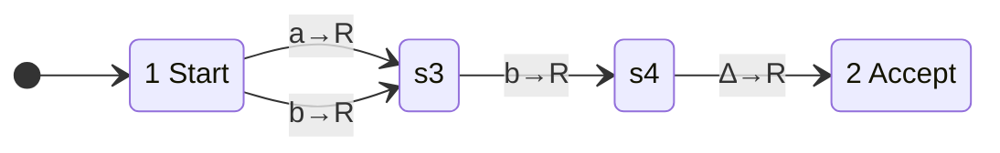

# [[Encoding Turing Machines (Code Words)]]

**Context:** [[FIT2014_MOC]] · turns a [[Turing Machines|Turing machine]] into a **string over $\{\texttt{a},\texttt{b}\}$** — the step that makes a machine into data and so makes the [[Universal Turing Machine]] possible
**Problem it solves:** *"a program is just another input"* — encode any TM as a word, decode any word back into a table.

> [!abstract] Quick Revision
> - **🎯 Trigger:** asked to encode/decode a TM, or to reason about the set of all TMs as a language ➔ go via the **transition table**, one row per instruction, each row $5$ fields.
> - **⚠️ Key Constraint:** $\text{CWL}$ is the set of **well-shaped** code words, not the set of TM codes — $\exists w\in\text{CWL}$ encoding **no** machine. Well-formed $\neq$ meaningful.

## 🧩 Fixed assumptions
- **Input alphabet** $\{\texttt{a},\texttt{b}\}$ · **tape alphabet** $\{\texttt{a},\texttt{b},\texttt{\#}\}$ (plus the blank $\Delta$) · **Start State** $=1$ · **Accept State** $=2$.
- **Why fixed** ➔ the encoding has no field for "which state is the start" or "how big is the alphabet"; those are conventions, so only the transitions need coding.

## 📝 Step 1 — the machine as a table
One row per transition, columns **From · To · Read · Write · Move**.

| From | To | Read | Write | Move |
| :--- | :--- | :--- | :--- | :--- |
| 1 | 3 | $\texttt{a}$ | $\texttt{a}$ | $R$ |
| 1 | 3 | $\texttt{b}$ | $\texttt{b}$ | $R$ |
| 3 | 4 | $\texttt{b}$ | $\texttt{b}$ | $R$ |
| 4 | 2 | $\Delta$ | $\Delta$ | $R$ |

### Validity conditions to check
- **A row with $1$ in the From column** ➔ otherwise the machine can never leave the Start State.
- **No row with $2$ in the From column** ➔ the Accept State is a halting state; nothing leaves it.
- **No two rows sharing the same From number *and* the same Read letter** ➔ this is exactly **determinism**; a duplicate pair makes the "machine" ill-defined.

## 📝 Step 2 — the code
| Field | Item | Code |
| :--- | :--- | :--- |
| State number | $n$ | $\texttt{a}^n\texttt{b}$ *(unary, $\texttt{b}$-terminated)* |
| Letter | $\texttt{a}$ / $\texttt{b}$ / $\Delta$ / $\texttt{\#}$ | $\texttt{aa}$ / $\texttt{ab}$ / $\texttt{ba}$ / $\texttt{bb}$ |
| Direction | $L$ / $R$ | $\texttt{a}$ / $\texttt{b}$ |

- **One instruction** ➔ $\underbrace{\texttt{a}^{\text{From}}\texttt{b}}_{\text{var}}\underbrace{\texttt{a}^{\text{To}}\texttt{b}}_{\text{var}}\underbrace{\square\square}_{\text{read}}\underbrace{\square\square}_{\text{write}}\underbrace{\square}_{\text{move}}$ — two variable-length unary fields, then exactly **5** fixed letters.
- **Whole machine** ➔ concatenate the instruction codes **with no separators and no spaces**. The $\texttt{b}$ terminators alone make it parseable.

### Worked encoding — the $\{\mathtt{a}^n\mathtt{b}^n\mathtt{a}^n\}$ machine
| From | To | Read | Write | Move | Code |
| :--- | :--- | :--- | :--- | :--- | :--- |
| 1 | 3 | $\texttt{a}$ | $\texttt{\#}$ | $R$ | `abaaabaabbb` |
| 3 | 3 | $\texttt{a}$ | $\texttt{a}$ | $R$ | `aaabaaabaaaab` |
| 3 | 4 | $\texttt{b}$ | $\texttt{b}$ | $R$ | `aaabaaaabababb` |
| 4 | 4 | $\texttt{b}$ | $\texttt{b}$ | $R$ | `aaaabaaaabababb` |
| 4 | 5 | $\texttt{a}$ | $\texttt{a}$ | $L$ | `aaaabaaaaabaaaaa` |
| 5 | 6 | $\texttt{b}$ | $\texttt{a}$ | $R$ | `aaaaabaaaaaababaab` |
| 6 | 6 | $\texttt{a}$ | $\texttt{a}$ | $R$ | `aaaaaabaaaaaabaaaab` |
| 6 | 7 | $\Delta$ | $\Delta$ | $L$ | `aaaaaabaaaaaaabbabaa` |
| 7 | 8 | $\texttt{a}$ | $\Delta$ | $L$ | `aaaaaaabaaaaaaaabaabaa` |
| 8 | 9 | $\texttt{a}$ | $\Delta$ | $L$ | `aaaaaaaabaaaaaaaaabaabaa` |
| 9 | 9 | $\texttt{a}$ | $\texttt{a}$ | $L$ | `aaaaaaaaabaaaaaaaaabaaaaa` |
| 9 | 9 | $\texttt{b}$ | $\texttt{b}$ | $L$ | `aaaaaaaaabaaaaaaaaabababa` |
| 9 | 1 | $\texttt{\#}$ | $\texttt{\#}$ | $R$ | `aaaaaaaaababbbbbb` |
| 1 | 2 | $\Delta$ | $\Delta$ | $R$ | `abaabbabab` |

- **Row 1 dissected** ➔ $1\mapsto\texttt{ab}$, $3\mapsto\texttt{aaab}$, read $\texttt{a}\mapsto\texttt{aa}$, write $\texttt{\#}\mapsto\texttt{bb}$, $R\mapsto\texttt{b}$ ⟹ `ab|aaab|aa|bb|b`.
- **The machine's code word** ➔ all fourteen rows run together as **one long string with no breaks**.

## 📝 Step 3 — the Code-Word Language
$$\text{CWL} = L\!\left(\,(\mathtt{a}\mathtt{a}^*\mathtt{b}\,\mathtt{a}\mathtt{a}^*\mathtt{b}\,(\mathtt{a}\cup\mathtt{b})^5)^*\,\right)$$
- **CWL is regular** ➔ it is defined by a [[Regular Expressions|regular expression]]: $\texttt{aa}^*$ forces a state number $\ge 1$, each $\texttt{b}$ terminates a unary field, $(\mathtt{a}\cup\mathtt{b})^5$ is read/write/move.
- **Every TM code lies in CWL** — but **not every word of CWL encodes a TM**: the shape is right while the *content* may violate the validity conditions (no From-$1$ row, a From-$2$ row, two rows with the same From and Read).

> [!NOTE] **Quantifier practice** *(the negation chain, cf. [[Quantifiers (Existential and Universal)]])*
> $$
> \begin{aligned}
> &\neg\,\forall w\in\text{CWL}\ \ \exists M: && w \text{ encodes } M\\
> \equiv\ &\exists w\in\text{CWL}\ \ \neg\,\exists M: && w \text{ encodes } M\\
> \equiv\ &\exists w\in\text{CWL}\ \ \forall M: && \neg\,(w \text{ encodes } M)\\
> \equiv\ &\exists w\in\text{CWL}\ \ \forall M: && w \text{ does not encode } M
> \end{aligned}
> $$

## 📝 Step 4 — decoding
While there are unread letters:
1. **Read and count the next clump of $\texttt{a}$s, then the $\texttt{b}$** ➔ the unary **From** state number.
2. **Read and count the next clump of $\texttt{a}$s, then the $\texttt{b}$** ➔ the unary **To** state number.
3. **Read the next two letters** ➔ the letter to be **Read**.
4. **Read the next two letters** ➔ the letter to be **Written**.
5. **Read the next letter** ➔ the **direction**.

### Worked decode — `abaaabaaaababaaabababbaaabaaaabababbaaaabaabbabab`
| Chunk | From | To | Read | Write | Move |
| :--- | :--- | :--- | :--- | :--- | :--- |
| `ab aaab aa aa b` | 1 | 3 | $\texttt{a}$ | $\texttt{a}$ | $R$ |
| `ab aaab ab ab b` | 1 | 3 | $\texttt{b}$ | $\texttt{b}$ | $R$ |
| `aaab aaaab ab ab b` | 3 | 4 | $\texttt{b}$ | $\texttt{b}$ | $R$ |
| `aaaab aab ba ba b` | 4 | 2 | $\Delta$ | $\Delta$ | $R$ |

**Result:** exactly the machine of Step 1 — it accepts $\{\texttt{ab},\texttt{bb}\}$, i.e. any first letter, then $\texttt{b}$, then end of input.

## ✍️ Practice
> [!QUESTION]- Practice 1: encode the successor machine — $1\xrightarrow{\texttt{a}\to R}1$ and $1\xrightarrow{\Delta\to\texttt{a},R}2$.
> > [!SUCCESS]- Reference solution
> > | From | To | Read | Write | Move | Fields | Code |
> > | :--- | :--- | :--- | :--- | :--- | :--- | :--- |
> > | 1 | 1 | $\texttt{a}$ | $\texttt{a}$ | $R$ | ab · ab · aa · aa · b | `ababaaaab` |
> > | 1 | 2 | $\Delta$ | $\texttt{a}$ | $R$ | ab · aab · ba · aa · b | `abaabbaaab` |
> >
> > Concatenated with no separator ⟹ **`ababaaaababaabbaaab`**.
> > - **Key move:** the **To** field is a full unary block with its own $\texttt{b}$ even when it repeats the From state — `abab…`, not `ab…`.

> [!QUESTION]- Practice 2: is `aabaaabaaaab` in CWL? Does `abaabaaaab` encode a Turing machine?
> > [!SUCCESS]- Reference solution
> > - **`aabaaabaaaab`** ➔ parse $\texttt{aab}$ (From $=2$), $\texttt{aaab}$ (To $=3$), then **5** letters `aaaab`. Shape matches $(\mathtt{aa}^*\mathtt{b}\,\mathtt{aa}^*\mathtt{b}\,(\mathtt{a}\cup\mathtt{b})^5)$ ⟹ **yes, in CWL**. But From $=2$ is the **Accept State**, violating a validity condition ⟹ it encodes **no** TM. This is the witness $w$ in the quantifier chain above.
> > - **`abaabaaaab`** ➔ $\texttt{ab}$ (From $=1$), $\texttt{aab}$ (To $=2$), then `aa` read $\texttt{a}$, `aa` write $\texttt{a}$, `b` move $R$ — one valid instruction $1\xrightarrow{\texttt{a}\to R}2$, a From-$1$ row exists, no From-$2$ row, no duplicate pair ⟹ **yes**, it encodes the TM accepting every string beginning with $\texttt{a}$.
> > - **Key move:** membership in CWL is a **regular-language** question (shape only); "encodes a TM" additionally demands the three **validity conditions**.

## ⚠️ Common Mistakes
- 💡 **CWL $\neq$ {codes of TMs}** ➔ the containment is **proper**; saying "CWL is the set of Turing machine encodings" throws away the whole point of the quantifier slide.
- 💡 **The state code is $\texttt{a}^n\texttt{b}$, the letter code is 2 letters** ➔ mixing the unary state alphabet with the fixed-width letter alphabet is the standard decoding derailment. Count $\texttt{a}$s **only until the next $\texttt{b}$**.
- 💡 **State $0$ is impossible** ➔ $\texttt{aa}^*$ requires at least one $\texttt{a}$, so state numbers start at $1$; a bare $\texttt{b}$ never opens a field.
- 💡 **No separators between instructions** ➔ the concatenated code word has no delimiter; only the field lengths make it unambiguous — which is why the $5$-letter tail is fixed-width.
- 💡 **Duplicate (From, Read) breaks determinism** ➔ a table can be well-shaped and still fail; check that condition explicitly before claiming a word encodes a machine.

## 🧠 Active Recall
> [!FAQ]- CWL is regular. Why doesn't that make "does $w$ encode a Turing machine?" a regular-language question too?
> > [!SUCCESS]- Answer
> > - **Short answer:** CWL only checks **syntax** — a repeated pattern of two unary fields plus five letters, which a finite automaton can verify. Encoding a TM additionally requires **global, cross-row** conditions: some row has From $=1$, no row has From $=2$, and no two rows share a (From, Read) pair.
> > - **Why:** **Cross-row comparison is unbounded matching** ➔ the duplicate check compares state numbers that can be arbitrarily far apart and arbitrarily large, the same unbounded-counting obstruction that made $\mathtt{a}^n\mathtt{b}^n$ non-regular in [[Proving a Language Non-Regular]]. Syntax is regular; consistency is not.

> [!FAQ]- Why must the read/write/move fields be fixed-width when the state fields are not?
> > [!SUCCESS]- Answer
> > - **Short answer:** because the code word is concatenated **without separators**, every field must be self-delimiting. The state fields are self-delimiting by their **terminator $\texttt{b}$** (unary $\texttt{a}$s can't contain one); the letter and direction fields can't use that trick — their alphabet is $\{\texttt{a},\texttt{b}\}$ — so they are delimited by **fixed length** instead ($2+2+1=5$).
> > - **Why:** **Two ways to be prefix-free** ➔ terminator or fixed width. The scheme uses each where it fits, which is exactly what lets the decoding algorithm run as a single left-to-right pass with no backtracking — and therefore be implementable **as a Turing machine**, which is the [[Universal Turing Machine|UTM]]'s inner loop.
