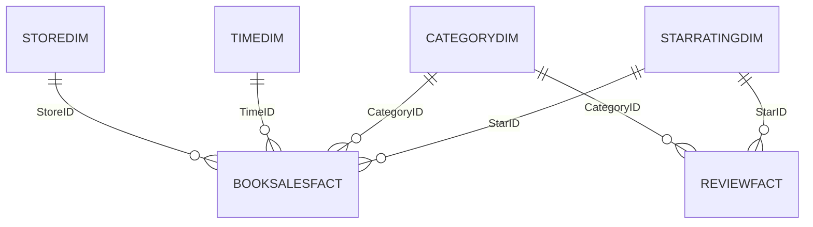

# [[Power BI]]

**Context:** [[FIT3003_MOC]] · the BI reporting layer on top of the warehouse — it presents what [[OLAP (On-Line Analytical Processing)|OLAP]] retrieves · lab case $=$ the W7 Book Sales star from [[Multi-Fact Star Schemas]]
**Parent Framework:** [[OLAP (On-Line Analytical Processing)]]

> [!abstract] Quick Revision
> - **🎯 Objective:** Microsoft's BI tool (desktop $+$ web) for loading, modelling and visualising data ➔ workflow **Data [Table] $\rightarrow$ Model $\rightarrow$ Report**, then publish to the Service portal.
> - **⚡ Key Constraint:** the Model must reproduce the star (dimension `1` $\rightarrow$ fact `*`), and every visual's default aggregation must match the measure ➔ otherwise the chart silently answers a different question.

## 📝 Core
- **Data [Table] view** ➔ connect, shape and transform raw data; shaping happens in the **Power Query Editor** (query pane · formula bar · table name & properties).
- **Model view** ➔ build table relationships $=$ the data model design.
- **Report view** ➔ pick a visual type (blank template), then tick or drag fields from the Data pane; numeric columns carry $\Sigma$ and are auto-aggregated ("Sum of NUM_OF_BOOKS by CATEGORYDESCRIPTION").
- **Connectors** ➔ files (CSV, text, Excel) · databases (SQL Server, **Oracle**, Azure) · online services (SharePoint, Dynamics 365, Salesforce, Google Analytics) · others (Web, Spark, semantic models); the list differs Desktop vs Web.
- **Desktop vs Web** ➔ Desktop: one application, left pane switches Report / Table / Model / DAX Query views, full data prep and modelling. Web: report editing and **semantic-model** editing are separate tabs (import tables first, then switch to *editing mode*, top right); data prep, import and advanced modelling are more restricted. Either completes the lab.
- **DAX** ➔ Data Analysis Expressions — the formula language (functions, operators, values) of Power BI, Analysis Services and Power Pivot; a DAX **query** must contain an `EVALUATE` statement (others: `DEFINE`, `MEASURE`, `VAR`, `ORDER BY`, `START AT`).
- **Filter scope** ➔ **visual** level (that visual only) · **page** level (every visual on the page) · **report** level (every visual on every page).
- **Publish & portal** ➔ Desktop work must be **published** to reach Power BI Service (Web work already lives there); the portal lists **Dashboards** (one auto-created per loaded workbook, same name), **Reports**, and **Semantic Models** (the connected data sources). **Mobile layout** re-arranges the visuals for a phone canvas.

## 🗂️ Schema
Book Sales semantic model — two facts sharing two dimensions:
- $\text{BookSalesFACT}(\underline{\text{StoreID}^*, \text{CategoryID}^*, \text{TimeID}^*, \text{StarID}^*}, \text{Num\_of\_Books}, \text{Total\_Sales})$
- $\text{ReviewFACT}(\underline{\text{CategoryID}^*, \text{StarID}^*}, \text{Num\_of\_Reviews})$
- $\text{StoreDIM}(\underline{\text{StoreID}}, \text{Address}, \text{Suburb}, \text{Postcode}, \text{State}, \text{Country})$ · $\text{TimeDIM}(\underline{\text{TimeID}}, \text{Month}, \text{Year})$ · $\text{CategoryDIM}(\underline{\text{CategoryID}}, \text{CategoryDescription})$ · $\text{StarRatingDIM}(\underline{\text{StarID}}, \text{StarDescription})$

- **Model view reading** ➔ `1` on each dimension, `*` on each fact; the two facts have **no** relationship to each other, only through the shared `CategoryDIM` and `StarRatingDIM`.
- **Filter propagation follows the lines** ➔ a slicer on a shared dimension filters both facts; `StoreDIM` and `TimeDIM` reach `BookSalesFACT` only, so review visuals ignore them.

## 📊 Applied Exercise
**Problem:** the five Book Sales requirements as visuals *(the SQL versions are in [[Multi-Fact Star Schemas]])*.

| Requirement | Fact | Fields | Aggregation | Deck's visual |
| :--- | :--- | :--- | :--- | :--- |
| total sales per bookstore per month | BookSalesFACT | Suburb (StoreDIM), Month (TimeDIM) | Sum of TOTAL_SALES | table |
| books sold per category | BookSalesFACT | CategoryDescription | Sum of NUM_OF_BOOKS | clustered column, Year as legend |
| category with the highest total sales | BookSalesFACT | CategoryDescription, sorted desc | **Sum** of TOTAL_SALES | treemap — built with *Count* ⚠️ |
| reviews per category | ReviewFACT | CategoryDescription | Sum of NUM_OF_REVIEW | donut |
| 5-star reviews per category | ReviewFACT | CategoryDescription $+$ visual-level filter StarDescription $=$ Excellent | Sum of NUM_OF_REVIEW | column / donut |

- **5 stars $=$ Excellent** ➔ the case defines the scale as 5 stars for excellent down to 1 for poor; the deck's funnel (Sum of NUM_OF_REVIEW by STARDESCRIPTION) shows Good $46$, Excellent $42$, Average $17$, Not Good $14$, Poor $7$.

## ⚠️ Common Mistakes
- 💡 **Accepting the default aggregation** ➔ the deck's treemap is "Count of TOTAL_SALES" — it counts fact rows per category, not dollars; switch the field to Sum.
- 💡 **ID on the axis** ➔ "Sum of NUM_OF_BOOKS by CATEGORYID" plots codes; management reads `CategoryDescription` from the dimension.
- 💡 **5-star filter at page level** ➔ `BookSalesFACT` also carries `StarID`, so a page filter silently restricts every sales visual on the page too; scope it to the visual.

## 🧠 Active Recall
> [!FAQ]- A report page holds a sales table and a reviews donut. Why does a StarRatingDIM slicer change both, while a StoreDIM slicer changes only the table?
> > [!SUCCESS]- Answer
> > - **Short answer:** filters flow along relationships, and only StarRatingDIM is related to both facts.
> > - **Why:** **Shared vs private dimensions** ➔ `StarRatingDIM` $\xrightarrow{1:*}$ `BookSalesFACT` and `ReviewFACT`; `StoreDIM` $\xrightarrow{1:*}$ `BookSalesFACT` only — `ReviewFACT` has no `StoreID`, so there is no path for the store filter to reach it.

> [!FAQ]- Desktop or Web — when does a finished report still need a separate step before colleagues can see it?
> > [!SUCCESS]- Answer
> > - **Short answer:** when it was built in Desktop ➔ **publish** it to Power BI Service.
> > - **Why:** **Two homes** ➔ Desktop files are local; Web reports and semantic models already live in the Service, whose portal lists Dashboards, Reports and Semantic Models.
