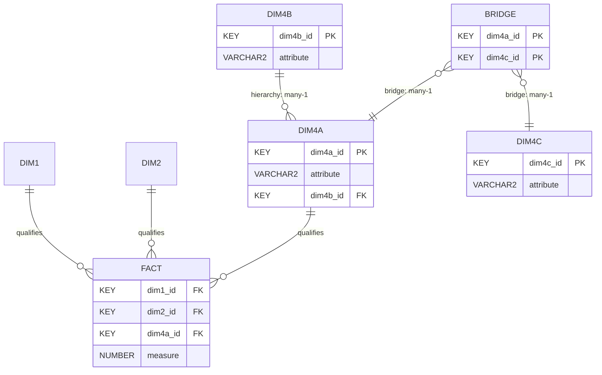

# [[Snowflake Schema]]

**Context:** [[FIT3003_MOC]] · a [[Star Schema]] in which at least one dimension is broken into two or more tables · the two ways this happens are [[Dimension Hierarchies]] and [[Bridge Tables]]

> [!abstract] Quick Revision
> - **🎯 Objective:** recognise that snowflaking is **one dimension decomposed into a chain**, then say which of the two families it is ➔ hierarchy (a design *choice*) or bridge (a design *necessity*).
> - **⚡ Key Constraint:** the default is still **every dimension linked directly to the fact**; a snowflake needs a reason, and "the tables would be in 3NF" is not one.

## 📝 Core
- **Definition** ➔ $\text{Dim4}$ is broken down into $\text{Dim4a} \rightarrow \text{Dim4b} \rightarrow \text{Dim4c}$; only $\text{Dim4a}$ still touches the fact. The other dimensions are one or more hops away.
- **Family 1 — [[Dimension Hierarchies|hierarchy]]** ➔ every table in the chain is a **dimension** with descriptive attributes; each link is **many-1** ($\text{Campus} \rightarrow \text{City} \rightarrow \text{Country}$).
- **Family 2 — [[Bridge Tables|bridge table]]** ➔ the middle table is a **key pair only**, resolving a **many-many** between the two dimensions it sits between; cardinality reads 1-many then many-1.
- **Why the middle matters** ➔ a bridge is forced by the operational E/R schema (the relationship *is* m–m ➔ [[Associative Entity]]); a hierarchy is optional and can always be flattened back into one dimension.
- **Cost of snowflaking** ➔ more tables ⟹ **more joins** per query; the fact-to-leaf path is no longer one hop, so OLAP loses the star's bounded join count.
- **3NF is a side effect, not a benefit** ➔ a flat $\text{CampusDIM}$ carrying $\text{City}, \text{State}, \text{Country}$ sits in **2NF**; splitting it reaches **3NF**, but the warehouse never pays the update-anomaly cost that 3NF buys off ➔ [[Star Schema]].

## 🗂️ Schema

*(the hierarchy leg and the bridge leg are drawn together for contrast — a real schema carries whichever one its case study forces)*

## ⚖️ Hierarchy Snowflake vs Bridge Snowflake
| Aspect | Hierarchy snowflake | Bridge snowflake |
| :--- | :--- | :--- |
| What the middle table is | a full dimension with attributes | a **key pair only**, no descriptive columns |
| Source cardinality | many-1 all the way down | **many-many** between the two dimensions |
| Optional? | yes — flatten into one dimension instead | **no** — the fact cannot hold the far key at all |
| What it buys | 3NF dimensions, nothing analytical | makes an otherwise unanswerable question answerable |
| Chapter | Ch4 ➔ [[Dimension Hierarchies]] | Ch5 ➔ [[Bridge Tables]] |

> [!NOTE] **When It Flips:** a hierarchy is worth drawing only when the child dimension is genuinely a *different subject* the analyst asks about on its own; a bridge is mandatory the moment the operational E/R shows an m–m between the fact's owner entity and the dimension entity.

## ⚠️ Common Mistakes
- 💡 **Snowflaking to "normalise the warehouse"** ➔ 3NF is the operational discipline; the warehouse trades redundancy for join count on purpose.
- 💡 **Calling any multi-table dimension a hierarchy** ➔ if the middle table holds only two keys it is a **bridge**, and the relationship it resolves is m–m, not many-1.

## 🧠 Active Recall
> [!FAQ]- Both a hierarchy and a bridge turn a star into a snowflake. How do you tell which one you are looking at, from the diagram alone?
> > [!SUCCESS]- Answer
> > - **Short answer:** read the **middle table's columns and the crow's feet** — attributes plus many-1 arrows means hierarchy; a bare key pair with a foot on **both** sides means bridge.
> > - **Why:** **Cardinality is the tell** ➔ a hierarchy chain is many-1 at every link, so each child row aggregates many parents; a bridge is 1-many then many-1 because it is the resolved form of a **many-many** ➔ [[Associative Entity]]. **Content is the confirmation** ➔ a bridge carries no descriptive attribute of its own (beyond history columns such as $\text{SupplyDate}$), because it describes a *relationship*, not a subject.
