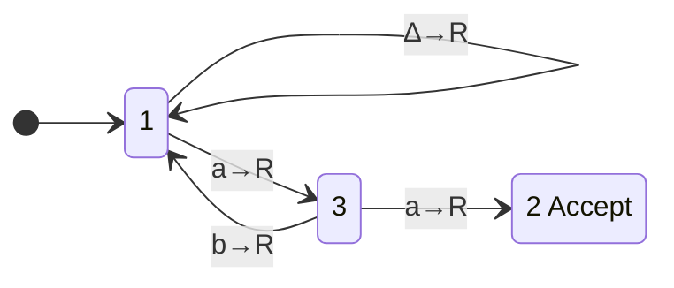

# [[Turing Machines]]

**Context:** [[FIT2014_MOC]] · the **outermost** machine model — a [[Pushdown Automata (PDA)|PDA]]'s stack replaced by an **unbounded read/write tape** · formalises "effective process" and underwrites [[Computable Functions and the Church-Turing Thesis]]

> [!abstract] Quick Revision
> - **🎯 Objective:** finite program + infinite tape + one head ➔ transitions $(\text{state},\text{symbol})\mapsto(\text{next state},\text{next symbol},\text{direction})$; the machine is **deterministic** and may **accept, reject, or loop forever**.
> - **📦 Core Components:** Tape ➔ infinite cells over a finite alphabet | Head ➔ read/write, one step $L$ or $R$ | Program ➔ numbered states, Start $=1$, Accept $=2$.
> - **⚡ Key Constraint:** a TM has **three** outcomes, not two — $\text{Accept}(T)$, $\text{Reject}(T)$, $\text{Loop}(T)$ **partition** $\Sigma^*$. Only a machine with $\text{Loop}(T)=\emptyset$ is a **decider**.

## 📝 How It Works

### 1. Effective process (what is being formalised)
- **Turing's checklist** ➔ a process is *effective/algorithmic* if it can be done with pencil and paper, follows a **finite** set of instructions, demands **neither insight nor ingenuity**, works **without error**, and in **finitely many steps** yields a final result (or, if the result is a sequence, each symbol of it).
- **The abstraction of a human computer** ➔ a person doing arithmetic is at any moment (i) at one **position** on the paper, (ii) reading the **symbol** there, (iii) in one **mental state**; they then **write** a symbol, possibly **change state**, and **move** their attention nearby. Every component of the TM is one of these three.

### 2. The machine
- **Tape** ➔ an **infinite** sequence of cells, each holding one symbol of a finite alphabet; initially the **input string** followed by **blanks** $\Delta$.
- **Tape head** ➔ sits on exactly one cell; can **read** it, **write** to it (overwriting), and **move one cell** $L$ or $R$ per step.
- **Program** ➔ a finite set of states numbered by integers: **Start State $=1$**, **Accept State $=2$**, optionally a **Reject State**. One state $\equiv$ one very low-level instruction.
- **Transition** ➔ $(\text{state},\text{symbol})\mapsto(\text{next state},\text{next symbol},\text{direction})$, drawn on an edge as $\texttt{a}\to\texttt{A},R$ (read $\texttt{a}$, write $\texttt{A}$, move right). Writing the same symbol back is abbreviated $\texttt{a}\to R$.
- **Computation** ➔ start in state $1$ on the first input cell; at each step apply the **one** applicable instruction. **Deterministic** — unlike an [[Finite Automata (DFA and NFA)|NFA]]/[[Pushdown Automata (PDA)|PDA]], there is no choice of path.
- **Crash $=$ reject** ➔ if no transition matches the current (state, symbol) pair the machine halts and **rejects**; an explicit Reject State is optional sugar.

### 3. The three languages of a TM
For a Turing machine $T$:

| Set | Membership condition | Halts? |
| :--- | :--- | :--- |
| $\text{Accept}(T)$ | strings that lead to the **Accept state** — *the language accepted by $T$* | yes |
| $\text{Reject}(T)$ | strings that **crash** or reach an explicit **Reject state** | yes |
| $\text{Loop}(T)$ | strings that make $T$ run **forever** | **no** |

- **⚡ Key Constraint:** the three sets are **disjoint and exhaust $\Sigma^*$** ➔ so $\text{Reject}(T)=\overline{\text{Accept}(T)}$ holds **only when** $\text{Loop}(T)=\emptyset$. This is the entire difference between "accepted" and "decided".

### 4. Deciders and decidability
- **Decider** ➔ a TM $T$ that **halts on every input**, i.e. $\text{Loop}(T)=\emptyset$.
- **Decider for $L$** ➔ a decider $T$ with $\text{Accept}(T)=L$ (hence $\text{Reject}(T)=\overline{L}$). It always settles, **in finite time**, whether any input is in $L$ — it never "dithers" forever.
- **Decidable language** ➔ one for which **some** decider exists.
- **Every regular language is decidable** ➔ witnessed constructively by the FA $\to$ TM conversion below.

### 5. Finite Automaton $\longrightarrow$ Turing Machine
A 5-step rewrite turning any [[Finite Automata (DFA and NFA)|FA]] into an equivalent TM (which is automatically a **decider** — it moves right on every step, so it halts within $|w|+1$ steps).

1. **Label** the start state $1$.
2. **Label** every other state with an integer $\ge 3$.
3. **Rewrite edge labels** $\texttt{a}\mapsto \texttt{a}\to R$, $\texttt{b}\mapsto \texttt{b}\to R$ — read, rewrite unchanged, advance.
4. **Un-double** every Final state's circle and add an edge from it to **State 2** labelled $\Delta\to R$ — "input exhausted **and** we were accepting".
5. **State 2** becomes the sole Final state.

- **Why $\Delta$ is the trigger** ➔ an FA accepts when the *input runs out* in a Final state; on a tape "input ran out" is literally "the head reads a blank".

### 6. Equivalent machines and variations
- **Other machines** ➔ **queue automaton** (deterministic PDA with a queue instead of a stack), **2PDA** (deterministic PDA with **two** stacks), **NTM** (nondeterministic TM), **$k$TM** (TM with $k$ tapes).
- **Equivalence theorem** ➔ *any language a Turing machine can accept can also be defined by any of these machines, and vice versa*; there are **algorithms** converting all of them into each other.
- **Variations that change nothing** ➔ allowing the head to **stay still**; a **two-way infinite** tape; **multiple** tapes; **separate** input/output/work tapes; **multi-dimensional** tapes. All give the **same class of computable functions**.
- **⚡ Contrast with the lower tiers** ➔ nondeterminism *did* matter for [[Pushdown Automata (PDA)|PDAs]] (deterministic PDAs are strictly weaker) but does **not** matter here — an NTM buys no extra languages, only speed.

---
## 📊 Exam Execution Trace

The three sets read straight off the missing and the self-looping rules:

- $\text{Accept}(T)=$ strings containing $\texttt{aa}$ — two $\texttt{a}$s in a row take $1\to3\to2$.
- $\text{Reject}(T)=$ strings **without** $\texttt{aa}$ that **end in $\texttt{a}$** — the head halts in state $3$ on a $\Delta$, and state $3$ has **no $\Delta$ rule** ⟹ crash.
- $\text{Loop}(T)=\varepsilon$ or strings without $\texttt{aa}$ ending in $\texttt{b}$ — these reach state $1$ on a $\Delta$, and $1\xrightarrow{\Delta\to R}1$ marches right over blanks **forever**.

Trace of $w=\texttt{abaa}$:

| Step | State | Head cell | Read | Write | Move | Next state |
| :--- | :--- | :--- | :--- | :--- | :--- | :--- |
| 0 | 1 | 0 | $\texttt{a}$ | $\texttt{a}$ | $R$ | 3 |
| 1 | 3 | 1 | $\texttt{b}$ | $\texttt{b}$ | $R$ | 1 |
| 2 | 1 | 2 | $\texttt{a}$ | $\texttt{a}$ | $R$ | 3 |
| 3 | 3 | 3 | $\texttt{a}$ | $\texttt{a}$ | $R$ | **2 — Accept** |

## ⚠️ Common Mistakes
- 💡 **"Not accepted" $\neq$ "rejected"** ➔ a string may **loop**. $\text{Reject}(T)=\overline{\text{Accept}(T)}$ requires the extra hypothesis $\text{Loop}(T)=\emptyset$; asserting it unconditionally is the single biggest mark-loss here.
- 💡 **Accepting $\neq$ deciding** ➔ *decidable* demands a machine that halts on **all** inputs, not merely one that accepts the right strings.
- 💡 **A TM halts the moment it enters state 2** ➔ it does not need to consume the whole tape, unlike an FA which must run out of input.
- 💡 **A missing transition is a crash, not a no-op** ➔ every (state, symbol) pair you leave undefined silently becomes a rejection; check the $\Delta$ rules deliberately.
- 💡 **Blanks are symbols** ➔ $\Delta$ is in the tape alphabet and can be read *and written*; forgetting this breaks every "have I reached the end?" test.

## 🧠 Active Recall
> [!FAQ]- Why does the definition of *decidable* need $\text{Loop}(T)=\emptyset$ rather than just $\text{Accept}(T)=L$?
> > [!SUCCESS]- Answer
> > - **Short answer:** because $\text{Accept}(T)=L$ alone leaves the **complement unresolved** — a string outside $L$ might crash (a genuine "no") *or* run forever, and an observer watching a non-halting run can never conclude "no".
> > - **Why:** **Three outcomes, not two** ➔ $\Sigma^*=\text{Accept}(T)\,\dot\cup\,\text{Reject}(T)\,\dot\cup\,\text{Loop}(T)$. Only killing the third block gives $\text{Reject}(T)=\overline{L}$, which is what "decides membership in finite time" means.

> [!FAQ]- What does the FA $\to$ TM construction prove, and why is the added $\Delta\to R$ edge essential?
> > [!SUCCESS]- Answer
> > - **Short answer:** it proves **every regular language is decidable** — the resulting TM only ever moves right, so it halts after at most $|w|+1$ steps on every input, making it a decider with $\text{Accept}(T)=L$.
> > - **Why:** **Blank $=$ end of input** ➔ an FA's acceptance test is "the input is exhausted while in a Final state", a condition with no direct tape analogue. The $\Delta\to R$ edge out of each old Final state into State $2$ *is* that test, rewritten as a tape observation.

> [!FAQ]- Nondeterminism strictly increased the power of a PDA. Why doesn't it increase the power of a Turing machine?
> > [!SUCCESS]- Answer
> > - **Short answer:** a deterministic TM can **simulate** an NTM by systematically exploring its computation tree on the tape (breadth-first over branch sequences), because the tape is unbounded scratch space. A deterministic PDA has only a stack and cannot record the alternatives it did not take.
> > - **Why:** **Unbounded rewritable memory absorbs the search** ➔ this is the same reason $k$TMs, two-way tapes and queue/2-stack machines all collapse to the same class: whatever extra structure you add can be **encoded onto one tape** and simulated, so the class of accepted languages is invariant.
